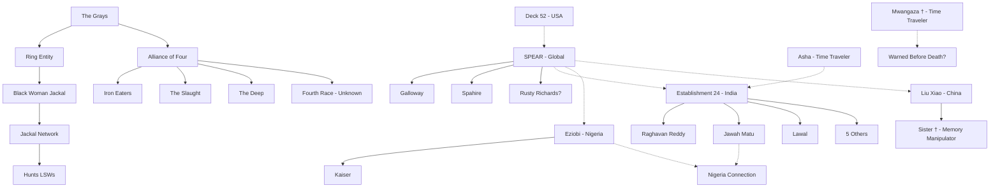
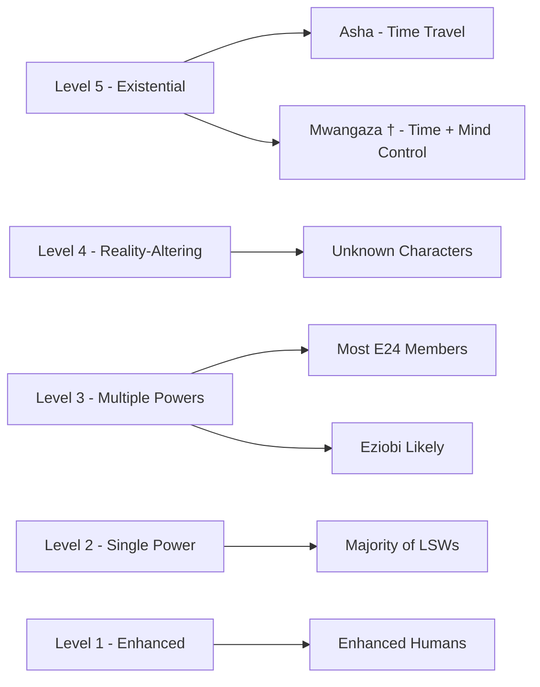
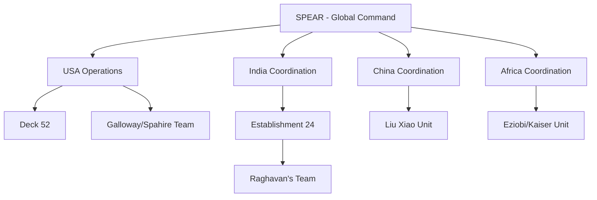
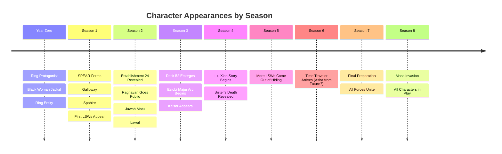

# CONSEQUENCES OF FAILURE - Character Connections Map

## Table of Contents
- [Main Organizations](#main-organizations)
- [Time Travelers](#time-travelers)
- [India - Establishment 24](#india---establishment-24)
- [United States - SPEAR & Deck 52](#united-states---spear--deck-52)
- [China](#china)
- [Africa - Nigeria & Uganda](#africa---nigeria--uganda)
- [The Jackals](#the-jackals)
- [The Grays & Aliens](#the-grays--aliens)
- [Visual Connection Diagrams](#visual-connection-diagrams)

---

# MAIN ORGANIZATIONS

## SPEAR (Special Personnel for Extraterrestrial Assault & Research)
**Type**: Global military organization
**Primary Base**: United States
**Scope**: International operations

### Key Members:
- **Galloway** - SPEAR Operative
- **Spahire** - SPEAR Operative (rival/partner to Galloway)
- **Unknown Commander** - Overall leader (needs identification)

### Connections:
- Works with Establishment 24 (India)
- Coordinates with Deck 52 (USA)
- Interfaces with national militaries globally

---

## Establishment 24
**Type**: India's powered human team
**Leader**: Colonel Raghavan "Gourav" Reddy (The Garuda)
**Base**: India
**Members**: 8 total

### Known Members:
1. **Raghavan "Gourav" Reddy** - Leader, "The Garuda", flight powers
2. **Jawah Matu** - India/Nigeria connection
3. **Lawal** - Member
4. **[5 Unknown Members]** - Powers/roles to be documented

### Connections:
- Allied with SPEAR
- Protects India
- Fought against Thug Birham (antagonist)
- Connected to Asha (time traveler, also in India)

---

## Deck 52
**Type**: American covert operations
**First Appearance**: Season 3
**Structure**: Unknown (possibly 52 members?)

### Connections:
- USA-based
- Works with/alongside SPEAR
- More secretive operations

---

## S.A.R.C. (Supporting Anomaly Research Center)
**Type**: Scientific research organization
**Focus**: Studying aliens and powered humans

### Connections:
- Provides intel to SPEAR
- Studies LSW powers
- Researches alien technology

---

# TIME TRAVELERS

## The Only Two

### Asha
**Location**: India
**Power**: Time travel (to the future) + retrieve objects from future
**Classification**: Level 5 Threat
**Status**: Alive

**Connections**:
- Operates in India (same region as Establishment 24)
- Possibly works with them or independently
- May be the "time traveler from future" in Season 6 (traveling to her own past)

### Zephaniah Mwangaza †
**Location**: Tanzania
**Powers**: Time travel + Mind control
**Status**: Deceased (before main story begins)

**Connections**:
- His death is significant to the timeline
- May have warned about the invasion before dying
- His fate serves as warning to Asha about the dangers

---

# INDIA - ESTABLISHMENT 24

## Core Structure

```
Colonel Raghavan "Gourav" Reddy (The Garuda)
                |
        [LEADER OF]
                |
    +-----------+-----------+
    |           |           |
  Jawah       Lawal    [6 Others]
   Matu
    |
[Also connected to Nigeria]
```

### Individual Profiles

#### Raghavan "Gourav" Reddy
- **Real Name**: Raghavan Reddy
- **Code Name**: Gourav
- **Title**: The Garuda (mythological bird)
- **Rank**: Colonel
- **Powers**: Flight (presumed), leadership
- **Role**: Leader of Establishment 24
- **Major Achievement**: Defended India against major threats

#### Jawah Matu
- **Origins**: Connected to both India AND Nigeria
- **Powers**: Unknown (needs documentation)
- **Role**: Bridge between Indian and African storylines?

#### Lawal
- **Origins**: Likely Nigerian or West African name
- **Powers**: Unknown
- **Connection**: Works with Establishment 24

#### Thug Birham
- **Role**: Antagonist to Establishment 24
- **Type**: Person? Organization? Alien-influenced?
- **Status**: Unknown fate
- **Conflict**: Fought against Establishment 24

---

# UNITED STATES - SPEAR & DECK 52

## SPEAR Operatives

### Galloway
- **Organization**: SPEAR
- **Role**: Field operative
- **Relationship**: Complex dynamic with Spahire
- **Powers/Skills**: Unknown (needs documentation)
- **Story Arc**: Major enough to have dedicated file (37KB)

### Spahire
- **Organization**: SPEAR
- **Role**: Field operative
- **Relationship**: Rival/partner to Galloway
- **Conflict**: Professional? Personal? Ideological?
- **Powers/Skills**: Unknown

### Rusty Richards
- **Organization**: Unknown (possibly SPEAR or Deck 52)
- **Origin**: Likely American (name suggests)
- **Role**: Unknown (12KB file)
- **Powers/Skills**: Unknown

---

# CHINA

## Liu Xiao
- **Location**: China
- **Role**: Main Chinese protagonist
- **Powers**: Unknown
- **Motivation**: Connected to his sister's death

### Liu Xiao's Sister †
- **Status**: Deceased (died "years ago")
- **Power**: Memory manipulation
- **Mystery**: Can she still manipulate memories after death? Or was power misunderstood?
- **Impact**: Drives Liu Xiao's story

**Connection Map**:
```
Liu Xiao ----[mourning/revenge?]----> Sister (deceased)
    |                                      |
    |                                 [Memory Manipulator]
    |
[Operating in China during invasion]
```

---

# AFRICA - NIGERIA & UGANDA

## Eziobi
- **Origin**: Nigeria
- **Span**: All 8 seasons (major character)
- **Story Size**: 291KB (massive arc)
- **Powers**: Unknown but significant
- **Role**: Regional hero/defender

### Kaiser
- **Connection**: Works with Eziobi
- **Location**: Nigeria/Uganda region
- **Story Size**: 11KB
- **Role**: Partner? Ally? Team member?

**Connection Map**:
```
    Eziobi (Nigeria)
        |
        +-------- Kaiser --------+
        |                        |
        |                        |
    [8 Season Arc]         [Connected to
                           Uganda/Nigeria]
```

### Uganda Leadership
- **President**: Ronald Opio (from CSV data)
- **Connection**: Possibly works with or opposes Eziobi/Kaiser
- **Status**: Competent? Corrupt? Unknown

### Jawah Matu Connection
- **Mystery**: How does Jawah Matu connect India to Nigeria?
- **Dual citizenship?**
- **Family ties?**
- **Mission assignment?**

---

# THE JACKALS

## The Black Woman (Name Unknown)
- **Introduction**: End of Ring series
- **Acquisition**: Gets the ring (alien surveillance tech)
- **Powers**: Access to total surveillance (every camera, every microphone)
- **Role**: Becomes a Jackal
- **Status**: Major threat or potential ally?

**Connection Map**:
```
Ring Entity (Alien Tech)
        |
        v
Black Woman Gets Ring
        |
        v
Becomes Jackal Leader?
        |
        +-----> [Hunts LSWs]
        |
        +-----> [Access to total surveillance]
        |
        +-----> [Potentially controlled by Grays]
```

### Jackal Network (Unnamed)
- **Role**: Hunt Living Super Weapons
- **Motivation**: Collect biological samples (blood, spit, CSF, etc.)
- **Employers**: Governments, corporations, aliens?
- **Impact**: Forces LSWs into hiding
- **Structure**: Independent contractors or organized?

**Effect on LSWs**:
```
Jackals Hunt LSWs → LSWs Hide → Can't Fight Aliens → Humanity Loses
```

---

# THE GRAYS & ALIENS

## The Ring Entity
- **Type**: Alien intelligence embedded in rock/mineral
- **Origin**: Extraterrestrial
- **Power**: "Hungry for knowledge"
- **Capabilities**:
  - Learned all human technology
  - Every camera = its eyes
  - Every microphone = its ears
  - Ring = communication interface

**Connection to Invasion**:
```
    Grays Deploy Ring Entity
            |
            v
    Gathers Psychological Intel
            |
            v
    Prepares Transformation Plan
            |
            v
    Alliance of Four Invades
```

## The Grays
- **Role**: Orchestrators behind Alliance of Four
- **Knowledge**: Mastered biology, needed psychology
- **Plan**: Transform humanity (not just destroy)
- **Method**: Use Ring Entity to gather intel

**Connection Map**:
```
        The Grays
            |
            +-----> Ring Entity (spying)
            |
            +-----> Alliance of Four
                        |
                        +---> Iron Eaters
                        +---> The Slaught
                        +---> The Deep
                        +---> [Fourth Race - Unknown]
```

---

# VISUAL CONNECTION DIAGRAMS

## Global Organization Network



## Power Level Hierarchy



## Regional Command Structure



## Timeline of Character Introductions



---

# CHARACTER RELATIONSHIP TYPES

## Allies
- Raghavan ↔ Establishment 24 members
- SPEAR ↔ Establishment 24
- Eziobi ↔ Kaiser
- SPEAR ↔ Deck 52 (probably)

## Rivals
- Galloway ↔ Spahire (complex)

## Enemies
- All Humans ↔ Alliance of Four
- LSWs ↔ Jackals
- Establishment 24 ↔ Thug Birham

## Unknown Relationships (Need Clarification)
- Asha ↔ Establishment 24 (works with them? independent?)
- Jawah Matu ↔ Nigeria characters (family? mission?)
- Rusty Richards ↔ Anyone (who does he connect to?)
- Black Woman Jackal ↔ Grays (knowing servant? unwitting tool?)
- Liu Xiao ↔ Chinese Government (working for? against?)

---

# CROSS-REGIONAL CONNECTIONS

## India ↔ Nigeria
**Link**: Jawah Matu
- Member of Establishment 24 (India)
- Has connection to Nigeria
- Possibly family origin or mission assignment
- Could connect to Eziobi story

## USA ↔ Global
**Link**: SPEAR
- Based in USA
- Operates globally
- Coordinates with regional forces

## Tanzania ↔ Time Travel
**Link**: Mwangaza
- Was from Tanzania
- Had time travel powers
- Death impacts Asha's story

## Ring ↔ Everyone
**Link**: Surveillance Network
- Ring Entity sees through all cameras
- Hears through all microphones
- Black Woman Jackal controls this
- Can track any character anywhere

---

# QUESTIONS ABOUT CONNECTIONS

1. **Does Asha work WITH Establishment 24 or separately?**
2. **How exactly does Jawah Matu bridge India and Nigeria?**
3. **What's Rusty Richards' connection to the main teams?**
4. **Do Galloway and Spahire eventually reconcile or stay rivals?**
5. **Does Liu Xiao ever connect with other regional heroes?**
6. **Is there a character who coordinates between all regions?**
7. **Do any humans work WITH the Grays knowingly?**
8. **Which character discovers the truth about the Ring Entity?**
9. **Does the Black Woman Jackal ever face Establishment 24?**
10. **Who leads the global defense in Season 8 - is there one supreme commander?**

---

# KEY MISSING CHARACTERS (Need Documentation)

## Establishment 24
- 5 unnamed members (powers, roles, backgrounds)

## SPEAR
- Overall commander/leader
- Other operatives beyond Galloway/Spahire

## Deck 52
- Any named members
- Leadership structure

## Jackals
- Other prominent Jackals besides Black Woman
- Jackal organization structure

## Chinese Forces
- Liu Xiao's team members (if any)
- Chinese government officials

## African Coalition
- Other heroes beyond Eziobi and Kaiser
- Government officials working with them

## Antagonists
- Thug Birham (details)
- Human collaborators with aliens
- Slaught Lords (names if any)

---

# NEXT STEPS

To complete this character map:
1. Name the 5 unknown Establishment 24 members
2. Clarify Asha's relationship to E24
3. Define Jawah Matu's India-Nigeria connection
4. Identify Rusty Richards' role and connections
5. Detail the Black Woman Jackal's character
6. Map out Deck 52's structure
7. Identify SPEAR's leadership
8. Create profiles for major antagonists
9. Show how regional forces coordinate in Season 8
10. Define the "high profile event" that unites LSWs

---

*This document will be updated as more character information is revealed.*
